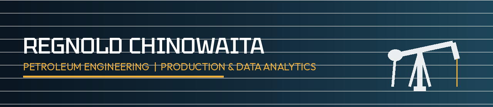

<b>Petroleum Engineering M.S. Candidate</b> · University of Oklahoma

Petroleum engineering graduate student combining hands-on subsurface/core-flow lab experience (permeability, porosity, EOR) with production engineering, PIPESIM/nodal analysis, and a process-safety background.

---

## Education

**University of Oklahoma** — Norman, OK
Master of Science in Petroleum Engineering *(Expected 2027)*, Graduate Certificate in Sustainable Energy Systems

**National University of Science and Technology** — Bulawayo, Zimbabwe
B.S. (Honors) in Chemical Engineering *(2023)*

## Experience

**Graduate Teaching Assistant — Reservoir Fluid Mechanics Lab**
*University of Oklahoma · August 2025 – Present*
Runs core-flooding and EOR lab sessions covering permeability, porosity, and waterflooding/surfactant-flooding experiments.

**Production Engineering Intern — Harare Water**
*Dec 2022 – Sept 2023*
Improved throughput and water-recovery efficiency by 18% through process simulation and pump station optimization.

## Technical Skills

| Category | Skills |
|---|---|
| Reservoir & Drilling | Reservoir Simulation, Well Logging & Interpretation, Pressure Transient Analysis |
| Production Engineering | Artificial Lift Design (ESP, Gas Lift, Rod Pump), Nodal Analysis, Well Performance Modeling, IPR |
| Engineering Software | PIPESIM, SuperPro |
| Programming & Data Analysis | Python, MATLAB, R |

## Featured Projects

### [Multi-Well Production Optimization & Artificial Lift Design](https://github.com/regnold007/multi-well-production-optimization)
Advanced Production Engineering term project — performed nodal analysis and PIPESIM multiphase-flow simulation across six wells to select optimum tubing/pipeline sizes and predict well performance over field life. Designed and sized ESP, gas lift, and rod pump systems via sensitivity studies on pump staging and operating frequency, and built an economic model covering oil price, water disposal, and lift power costs.

### [ESP Well Failure Prediction — 30-Day Early Warning System](https://github.com/regnold007/esp-failure-prediction)
Data analytics project — built a Random Forest classifier to predict Electrical Submersible Pump failures up to 30 days in advance from sensor and production data (SPE E-Challenge dataset, 94 wells). Addressed severe class imbalance with SMOTE and engineered rolling degradation-signature features, achieving 0.992 AUC and 91% recall on held-out test wells, with output translated into a CRITICAL/HIGH/MEDIUM/LOW risk dashboard.

### Gold Bio-Leaching Processing Plant Design (2,950 t/day)
Process design of a bio-leaching plant to extract gold from tailings, including solid-liquid separation and comminution circuit design, with an economic feasibility assessment.

### Water Treatment Chemical Dosing Optimization
MATLAB model comparing oxidant costs (H2O2 vs. ClO2) to reduce treatment chemical expenses while maintaining water quality.

## GitHub Activity

## Connect

[Email](mailto:regnoldchinowaitaa@gmail.com)

